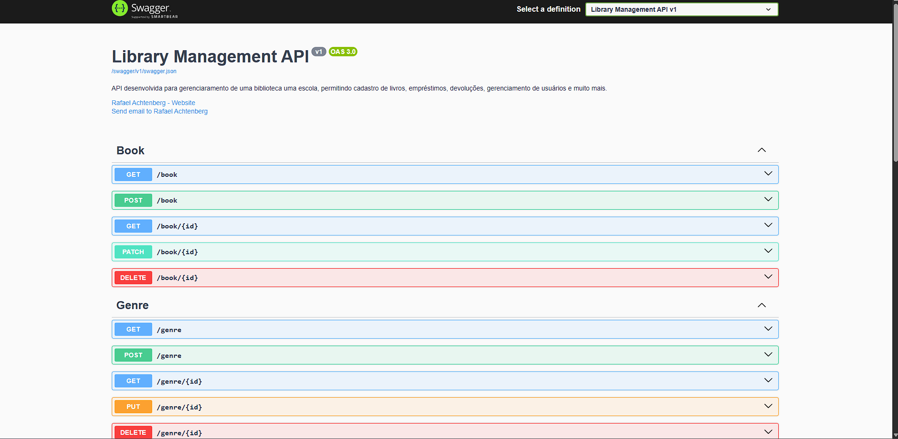
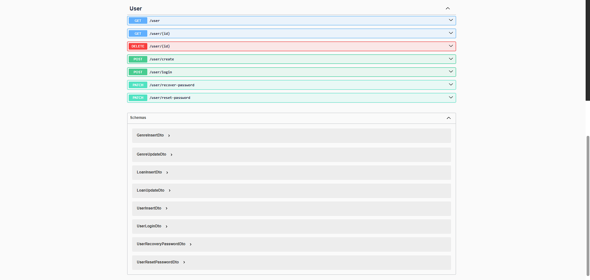

## Library management

A Library Management API foi desenvolvida para atender uma necessidade real da escola onde atuo como estagiário administrativo, que conta com mais de 800 alunos e colaboradores.
O projeto surgiu da demanda por um controle mais eficiente dos livros, tanto didáticos quanto de outros gêneros, otimizando processos de empréstimo, devolução, organização do acervo e gerenciamento dos usuários da biblioteca.

Essa API permite realizar de forma simples e organizada:

- 📚 Cadastro, atualização e exclusão de livros e gêneros.

- 👤 Gerenciamento de usuários com autenticação e autorização via JWT.

- 🔄 Controle completo de empréstimos, devoluções e disponibilidade dos livros.

- 📑 Documentação interativa com Swagger/OpenAPI.

- 🚀 Proteções aplicadas, como Rate Limiting, autenticação e validação robusta.

Com esse sistema, conseguimos reduzir retrabalho, melhorar o controle dos livros disponíveis, ter registros precisos e garantir mais organização na gestão da biblioteca da instituição.

## Arquitetura

O projeto adota uma arquitetura monolítica, estruturada com base nos princípios da Clean Architecture, promovendo uma separação clara entre as camadas de domínio, aplicação e infraestrutura.

Para garantir facilidade de deploy e ambiente padronizado, o projeto está containerizado utilizando Docker.

## 🗂️ Padrões e Conceitos Utilizados:

- Repository Pattern
  Cria uma camada de abstração entre a aplicação e a fonte de dados. Ele isola a lógica de acesso ao banco, permitindo que a aplicação não dependa diretamente do ORM (Entity Framework) e facilitando testes e manutenção.

- DTO (Data Transfer Object)
  Utilizado para transportar dados entre as camadas da aplicação, especialmente entre a API e os serviços. Garante que apenas os dados necessários sejam expostos ou recebidos, aumentando a segurança e a eficiência da aplicação.

- Service Layer
  Camada responsável por orquestrar as regras de negócio da aplicação. Ela interage com os repositórios e aplica as regras antes de retornar os dados para o controller ou salvar no banco.

- Dependency Injection (Injeção de Dependências)
  Aplicada de forma extensiva para reduzir o acoplamento entre os componentes, facilitar testes e permitir maior flexibilidade na troca de implementações.

- JWT (JSON Web Token)
  Aplicado para autenticação e autorização segura, permitindo proteger rotas e controlar acesso a recursos sensíveis da aplicação.

## 🛠️ Tecnologias Utilizadas

- [.NET](https://dotnet.microsoft.com/pt-br/)
- [ASP.NET](https://learn.microsoft.com/pt-br/aspnet/core/?view=aspnetcore-9.0&WT.mc_id=dotnet-35129-website)
- [JWT](https://jwt.io/)
- [Entity-Framework-Core](https://learn.microsoft.com/en-us/ef/core/)
- [SqlServer](https://www.microsoft.com/pt-br/sql-server/sql-server-downloads)
- [XUnit](https://learn.microsoft.com/pt-br/dotnet/core/testing/unit-testing-csharp-with-xunit)
- [Moq](https://learn.microsoft.com/pt-br/shows/visual-studio-toolbox/unit-testing-moq-framework)

## Documentação

Api Documentada via OpenApi.

🔧 **DevOps e Deploy**

- [Git](https://git-scm.com)
- [Docker](https://www.docker.com/)

🚀 **Como Rodar o Projeto**

Para rodar o projeto em seu ambiente local, siga os passos abaixo:

1.  Clonar o Repositório
    Primeiramente, clone o repositório do GitHub para sua máquina local:

    $ git clone https://github.com/Faelkk/management-library

2.  Instalar as Dependências
    Acesse o diretório do projeto e instale as dependências:

        $ dotnet restore

3.  Configurar o Docker Compose
    Antes de rodar o projeto, configure as variáveis do docker-compose de acordo com as suas necessidades. Certifique-se de que o Docker e o Docker Compose estão instalados corretamente em sua máquina.

4.  Construir o Projeto com Docker
    Crie as imagens do Docker para o projeto:

        $ docker compose build

5.  Subir o Projeto
    Finalmente, suba o projeto utilizando Docker Compose:

        $ docker compose up -d

 

🤝 **Como Contribuir?**

- ⭐ Deixe uma estrela no repositório.
- 🔗 Me siga aqui no GitHub.
- 👥 Conecte-se comigo no LinkedIn e faça parte da minha rede profissional.

👨‍💻**Autor**
Desenvolvido por [Rafael Achtenberg](linkedin.com/in/rafael-achtenberg-7a4b12284/).
